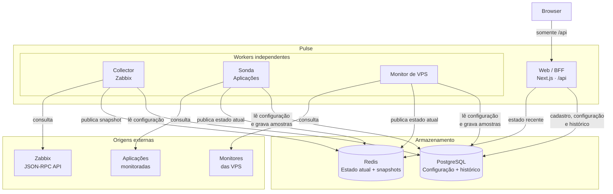

# Arquitetura da aplicação e dos workers

## Visão geral

O **Pulse** é uma aplicação **Next.js** composta por:

- uma aplicação **Web/BFF**;
- um banco **PostgreSQL**;
- um **Redis**;
- três workers independentes:
  - **Collector**;
  - **Sonda**;
  - **Monitor de VPS**.

O browser **nunca acessa diretamente** PostgreSQL, Redis, Zabbix, aplicações monitoradas ou monitores de VPS.

Toda comunicação do browser acontece exclusivamente com o **BFF**, através das rotas `/api`.

Os workers também **não se comunicam entre si** e não são chamados pelo Web/BFF através de HTTP.

Cada worker executa seu próprio ciclo de coleta, consulta sua respectiva origem e publica o resultado nos armazenamentos compartilhados.

---

## Arquitetura



### Como interpretar o diagrama

Existem quatro responsabilidades distintas:

1. **Browser**
   - renderiza a interface;
   - chama somente `/api`;
   - não conhece Redis, PostgreSQL ou qualquer serviço monitorado.

2. **Web / BFF**
   - autentica as requisições;
   - administra os cadastros;
   - consulta PostgreSQL e Redis;
   - monta as respostas consumidas pela interface.

3. **Workers**
   - executam coleta em segundo plano;
   - consultam suas respectivas origens;
   - publicam o estado recente no Redis;
   - quando necessário, persistem histórico no PostgreSQL.

4. **Origens externas**
   - nunca são chamadas diretamente pelo browser;
   - são acessadas exclusivamente pelo worker responsável.

Não existe comunicação:

```text
Browser -> Redis
Browser -> PostgreSQL
Browser -> Zabbix
Browser -> Aplicações
Browser -> Monitores de VPS

Web/BFF -> Worker
Worker -> Worker
```

A integração acontece através dos armazenamentos compartilhados.

---

# Papel de cada armazenamento

## PostgreSQL

O PostgreSQL é a fonte persistente de informação do Pulse.

Ele armazena:

- configuração humana;
- cadastro dos serviços;
- cadastro das VPS;
- configurações da interface;
- histórico que precisa permanecer;
- amostras coletadas pela Sonda;
- amostras coletadas pelo Monitor de VPS.

O Collector do Zabbix **não grava telemetria histórica no PostgreSQL**.

Ele apenas lê a configuração necessária para executar sua coleta.

---

## Redis

O Redis representa principalmente o **estado recente do sistema**.

Ele guarda informações descartáveis ou reconstruíveis, como:

- último snapshot do Zabbix;
- inventário recente;
- problemas atuais;
- último resultado das sondas;
- último resultado dos monitores de VPS;
- estado da última sincronização.

Se o Redis for perdido, os workers podem reconstruir esses dados durante novos ciclos de coleta.

Por isso:

> **PostgreSQL representa configuração e histórico. Redis representa o estado operacional recente.**

---

# Fluxo de funcionamento

O fluxo normal da aplicação é:

```text
1. Usuário altera um cadastro
        ↓
2. Browser envia a alteração para /api
        ↓
3. BFF valida e grava no PostgreSQL
        ↓
4. Worker lê o cadastro no próximo ciclo
        ↓
5. Worker consulta a origem externa
        ↓
6. Worker classifica o resultado
        ↓
7. Worker publica o estado recente no Redis
        ↓
8. Quando aplicável, grava uma amostra no PostgreSQL
        ↓
9. Browser solicita novamente os dados ao BFF
        ↓
10. BFF combina Redis + PostgreSQL
        ↓
11. Interface é atualizada
```

O browser **não solicita uma atualização diretamente ao worker**.

Quando a interface faz um novo GET, o BFF simplesmente lê o estado que já foi produzido pelos workers.

---

# Separação entre Web e workers

Há um processo Web e três workers.

Eles usam a mesma imagem da aplicação, mas executam processos diferentes.

O comando configurado no container determina qual processo será iniciado.

Por exemplo:

```text
Mesma imagem Docker
│
├── Web / BFF
│
├── Collector
│
├── Sonda
│
└── Monitor de VPS
```

Cada processo possui:

- ciclo de vida independente;
- intervalo próprio;
- trava própria;
- responsabilidade própria;
- limites de concorrência próprios;
- chaves Redis próprias.

Reiniciar um worker não exige reiniciar o Web ou os demais workers.

---

# Inicialização da aplicação

O entrypoint da imagem executa:

```bash
prisma migrate deploy
```

antes de iniciar o processo principal.

A migration utiliza a trava de sessão:

```text
734021001
```

Web e workers utilizam:

- a mesma imagem;
- o mesmo contrato de ambiente;
- o mesmo schema Prisma;
- os mesmos PostgreSQL e Redis.

O comando do container determina qual processo deve subir.

---

# Vantagens desta arquitetura

A separação dos processos evita acoplamento entre diferentes tipos de monitoramento.

Entre as principais vantagens:

- uma falha em um monitor não faz o Zabbix aparecer como indisponível;
- uma falha em um worker não apaga o snapshot produzido pelos demais;
- cada origem possui seu próprio intervalo;
- cada origem possui seu próprio limite de concorrência;
- cada worker pode ser reiniciado isoladamente;
- cada worker pode possuir sua própria réplica;
- o Web/BFF não precisa conhecer detalhes de implementação da coleta;
- o browser não precisa alcançar as redes onde estão os serviços monitorados;
- credenciais permanecem no servidor;
- chaves de API não são devolvidas pela visão geral;
- um novo monitor não precisa ser incorporado ao Collector;
- falhas em um tipo de monitoramento ficam isoladas dos demais.

A trava de sessão impede duas instâncias do mesmo worker de trabalharem simultaneamente.

As travas de transação utilizadas nos cadastros evitam escritas concorrentes sobre a mesma configuração.

---

# Workers atuais

| Worker | Processo | Origem | Intervalo | Trava de sessão | Redis | PostgreSQL |
|---|---|---|---|---|---|---|
| **Collector** | `collector/index.mjs` | API JSON-RPC do Zabbix 7.0 | `COLLECTOR_INTERVAL_MS`, 15000–30000, padrão 20000 | `734021004` | `pulse:snapshot:overview`, `pulse:inventory:hosts`, `pulse:problems:current`, `pulse:sync:last` | somente leitura da configuração |
| **Sonda** | `collector/probe.mjs` | URL cadastrada em Aplicações | `PROBE_INTERVAL_MS`, ausente = 60000; preenchido = 30000–120000 | `734021007` | `pulse:probe:result:{id}`, `pulse:probe:sync` | `external_service_sample` |
| **Monitor de VPS** | `collector/vps-monitor.mjs` | `baseUrl` da VPS, `/ping/latency` e `/status` | `VPS_MONITOR_INTERVAL_MS`, mesma regra da Sonda | `734021009` | `pulse:vps:result:{id}` | `vps_monitor_sample` |
| **Monitor Signal** | `collector/signal-monitor.mjs` | `SIGNAL_API_BASE_URL` + paths env + alvos PG | `SIGNAL_MONITOR_INTERVAL_MS`, mesma regra da Sonda | `734021011` | `pulse:signal:result:{id}`, `pulse:signal:sync` | `signal_monitor_sample` |

---

# Collector

Processo:

```text
collector/index.mjs
```

O Collector é responsável exclusivamente pela integração com o Zabbix.

## Responsabilidades

Ele consulta:

- hosts;
- containers;
- problemas;
- métricas;
- informações necessárias para a visão geral.

Origem:

```text
Zabbix 7.0
JSON-RPC API
```

## PostgreSQL

O Collector lê a configuração necessária no PostgreSQL.

Ele **não grava telemetria histórica no PostgreSQL**.

## Redis

O Collector publica uma geração completa utilizando:

```text
pulse:snapshot:overview
pulse:inventory:hosts
pulse:problems:current
pulse:sync:last
```

Se um ciclo falhar, o estado da falha é registrado em:

```text
pulse:sync:last
```

O Collector não consulta:

- aplicações externas;
- VPS avulsas;
- monitores HTTP pertencentes a outros workers.

---

# Sonda

Processo:

```text
collector/probe.mjs
```

A Sonda monitora as aplicações cadastradas no Pulse.

## Seleção dos alvos

Ela consulta somente aplicações:

- ativas;
- corretamente configuradas;
- não pausadas, quando existir suporte a pausa.

## Concorrência

A Sonda consulta até:

```text
8 aplicações simultaneamente
```

## Timeout

Cada aplicação possui seu próprio:

```text
timeoutMs
```

Faixa permitida:

```text
1000–30000 ms
```

Valor padrão:

```text
5000 ms
```

## PostgreSQL

Cada resultado gera uma amostra em:

```text
external_service_sample
```

As amostras permanecem por:

```text
30 dias
```

## Redis

O resultado recente é publicado em:

```text
pulse:probe:result:{id}
```

O estado da sincronização da Sonda utiliza:

```text
pulse:probe:sync
```

Uma falha da Sonda:

- não grava `pulse:sync:last`;
- não altera as chaves do Collector;
- não altera as chaves do Monitor de VPS.

## Travas

Trava de sessão:

```text
734021007
```

Trava utilizada na escrita do cadastro de aplicações externas:

```text
734021008
```

---

# Monitor de VPS

Processo:

```text
collector/vps-monitor.mjs
```

O Monitor de VPS é responsável pelas VPS avulsas cadastradas no Pulse.

## Seleção dos alvos

Ele consulta somente VPS:

- ativas;
- com URL base configurada;
- com chave configurada;
- com o monitor fora de pausa.

## Endpoints consultados

A partir de:

```text
baseUrl
```

são consultados:

```text
/ping/latency
/status
```

## Concorrência

O limite atual é:

```text
8 VPS simultaneamente
```

## PostgreSQL

As amostras são armazenadas em:

```text
vps_monitor_sample
```

## Redis

O resultado recente é publicado em:

```text
pulse:vps:result:{id}
```

O resultado publicado não inclui:

- chave;
- credencial;
- URL contendo credencial.

Uma falha deste worker:

- não grava `pulse:sync:last`;
- não altera dados da Sonda;
- não altera snapshots do Collector.

## Travas

Trava de sessão:

```text
734021009
```

Trava utilizada na escrita do cadastro de VPS avulsas:

```text
734021010
```

---

# Monitor Signal

Processo:

```text
collector/signal-monitor.mjs
```

O Monitor Signal consulta a API pública do Softcom Signal.

## Seleção dos alvos

Ele consulta alvos `enabled = true` no PostgreSQL.

Quando `SIGNAL_API_BASE_URL` está definida, o ciclo garante um alvo com essa base URL (seed). Ausente ou vazia, só entram os cadastros do banco.

## Endpoints consultados

A partir de:

```text
baseUrl
```

são consultados os paths de:

```text
SIGNAL_HEALTH_LIVE_PATH
SIGNAL_HEALTH_READY_PATH
```

Defaults:

```text
/health/live
/health/ready
```

Sem Authorization neste MVP. Sem seguir redirect.

## Concorrência

O limite atual é:

```text
4 alvos simultaneamente
```

## PostgreSQL

As amostras são armazenadas em:

```text
signal_monitor_sample
```

Retenção de 30 dias, apagada no ciclo.

## Redis

O resultado recente é publicado em:

```text
pulse:signal:result:{id}
pulse:signal:sync
```

O payload sanitiza `checks` (deps, worker, pipeline, knowledgeIndex). Não inclui headers, tokens nem corpo cru.

Uma falha deste worker:

- não grava `pulse:sync:last`;
- não altera dados da Sonda;
- não altera o Monitor de VPS;
- não altera snapshots do Collector.

## Travas

Trava de sessão:

```text
734021011
```

Trava utilizada na escrita do cadastro de alvos Signal:

```text
734021012
```

---

# Execução local dos workers

Os processos podem ser iniciados individualmente.

## Collector

```bash
npm run collector
```

## Sonda

```bash
npm run probe
```

## Monitor de VPS

```bash
npm run vps-monitor
```

## Monitor Signal

```bash
npm run signal-monitor
```

---

# Modos auxiliares

## `:once`

Executa apenas um ciclo e encerra.

Exemplo conceitual:

```bash
npm run probe:once
```

Útil para:

- testes;
- diagnóstico;
- validação manual;
- automação de testes.

---

## `--check`

O parâmetro:

```text
--check
```

valida somente se o runtime do processo consegue iniciar.

Ele não consulta a origem externa.

É utilizado principalmente para verificar:

- imports;
- configuração;
- inicialização;
- dependências necessárias ao processo.

---

# Deploy na stack

Na stack, cada processo é um serviço separado.

Estrutura conceitual:

```text
Pulse
│
├── pulse-web
│   └── Traefik
│
├── pulse-collector
│   └── sem porta publicada
│
├── pulse-probe
│   └── sem porta publicada
│
├── pulse-vps-monitor
│   └── sem porta publicada
│
└── pulse-signal-monitor
    └── sem porta publicada
```

Cada worker utiliza:

```text
replicas: 1
```

Os workers:

- não publicam portas;
- não possuem labels do Traefik;
- não recebem requisições HTTP do browser;
- executam apenas processamento interno.

A estratégia de atualização é:

```text
stop-first
```

O Web/BFF é o único serviço exposto através do Traefik.

---

# Travas reservadas

As chaves abaixo já possuem utilização definida.

Não devem ser reutilizadas.

| Chave | Responsabilidade |
|---|---|
| `734021001` | migration no entrypoint |
| `734021003` | escrita de configuração de apresentação |
| `734021004` | sessão do Collector |
| `734021005` | escrita de templates |
| `734021006` | escrita de exibição de VM |
| `734021007` | sessão da Sonda |
| `734021008` | escrita de aplicações externas |
| `734021009` | sessão do Monitor de VPS |
| `734021010` | escrita de VPS avulsas |
| `734021011` | sessão do Monitor Signal |
| `734021012` | escrita de alvos Signal |

Para novas funcionalidades, deve ser utilizado o próximo inteiro livre dentro do espaço reservado:

```text
7340210xx
```

---

# Especificação para novos serviços de monitoramento

Um novo tipo de monitoramento deve seguir o mesmo modelo arquitetural.

A regra principal é:

> **Novo monitor = novo worker independente.**

Ele não deve ser incorporado ao:

- Collector;
- Sonda;
- Monitor de VPS.

Estrutura conceitual:

```text
Cadastro
   │
   ▼
PostgreSQL
   ▲
   │ lê configuração
   │
Novo Worker ───────────► Origem externa
   │
   ├────────► Redis
   │          estado recente
   │
   └────────► PostgreSQL
              histórico, quando necessário
```

---

## 1. Processo próprio

Crie um comando próprio dentro de:

```text
collector/
```

Adicione:

- script `npm run`;
- serviço próprio na stack de produção;
- serviço próprio na stack de desenvolvimento.

O serviço deve possuir:

```text
replicas: 1
```

Não deve possuir:

- porta publicada;
- router Traefik;
- labels Traefik.

A atualização deve utilizar:

```text
stop-first
```

---

## 2. Trava de sessão

Reserve uma nova trava dentro do espaço:

```text
7340210xx
```

Ela deve impedir duas instâncias simultâneas do mesmo worker.

Caso outra instância já esteja executando, o processo deve recusar a execução utilizando um código próprio no formato:

```text
*_already_running
```

O cadastro administrativo deve possuir outra trava, de transação, quando necessário.

---

## 3. Intervalo próprio

Cada worker possui sua própria variável de ambiente.

Exemplo:

```text
NOVO_SERVICO_INTERVAL_MS
```

Não reutilize:

```text
COLLECTOR_INTERVAL_MS
```

A regra deve ser:

```text
variável ausente/vazia
        ↓
usa valor padrão documentado
```

```text
variável preenchida e válida
        ↓
usa valor configurado
```

```text
variável preenchida e inválida
        ↓
processo não inicia
```

---

## 4. Seleção dos alvos

O worker lê seus alvos no PostgreSQL.

Somente registros válidos entram na rodada.

Normalmente:

```text
ativo
+
configuração completa
+
não pausado
```

quando o serviço possuir suporte a pausa.

---

## 5. Origem chamada exclusivamente pelo worker

O browser nunca chama a origem.

O fluxo permanece:

```text
Browser
   ↓
/api
   ↓
BFF
```

e separadamente:

```text
Worker
   ↓
Origem externa
```

---

## 6. Persistência

Quando existir histórico, crie uma tabela específica para as amostras do novo monitor.

Exemplo:

```text
novo_servico_sample
```

O estado recente deve possuir um namespace Redis próprio.

Exemplo:

```text
pulse:<serviço>:result:{id}
```

O novo worker não deve escrever nas chaves pertencentes a outro processo.

Não deve escrever:

```text
pulse:sync:last
pulse:probe:*
pulse:vps:*
```

a menos que seja explicitamente o proprietário daquela chave.

---

## 7. Isolamento de falhas

Uma falha:

- da origem;
- da rede;
- do Redis;
- de uma consulta individual;

não deve apagar:

- amostras já persistidas;
- snapshot de outro worker;
- resultado de outro monitor.

Cada worker é responsável exclusivamente pelo seu namespace.

---

## 8. Integração com o BFF

O BFF continua sendo o ponto de acesso da interface.

Quando o novo monitor precisar aparecer na visão geral:

1. o BFF autentica a requisição;
2. consulta o estado produzido pelo novo worker;
3. adiciona um campo opcional à resposta;
4. o front-end renderiza esse campo.

O Collector do Zabbix não precisa conhecer o novo serviço.

---

## 9. Logs

Os logs devem utilizar JSON.

Regra:

```text
1 evento = 1 linha
```

Não registrar:

- chave de API;
- token;
- senha;
- URL contendo credencial;
- headers sensíveis;
- corpo completo retornado pela origem quando puder conter informação sensível.

---

## 10. Ciclo de vida

Todo novo worker deve oferecer:

```text
--once
```

para executar um único ciclo.

E:

```text
--check
```

para validar apenas o runtime.

O processo deve tratar:

```text
SIGINT
SIGTERM
```

Quando receber o sinal:

1. interrompe a espera por um novo ciclo;
2. não inicia novas rodadas;
3. permite que o ciclo atual termine;
4. encerra o processo de forma limpa.

---

## 11. Limites explícitos

O contrato do worker deve documentar:

- quantidade máxima de cadastros;
- concorrência máxima;
- timeout mínimo;
- timeout máximo;
- timeout padrão;
- intervalo mínimo;
- intervalo máximo;
- intervalo padrão;
- política de retenção das amostras.

Como referência, Sonda e Monitor de VPS já utilizam limites explícitos, incluindo:

```text
até 100 alvos cadastrados
```

e timeout por consulta dentro do intervalo:

```text
1–30 segundos
```

---

# Regra arquitetural

A arquitetura deve continuar respeitando esta divisão:

```text
                         ┌────────────────┐
                         │    Browser     │
                         └───────┬────────┘
                                 │
                              /api
                                 │
                         ┌───────▼────────┐
                         │   Web / BFF    │
                         └───────┬────────┘
                                 │
                    lê configuração e estado
                                 │
                 ┌───────────────┴───────────────┐
                 │                               │
          ┌──────▼──────┐                 ┌──────▼──────┐
          │ PostgreSQL  │                 │    Redis    │
          │ config/hist │                 │ estado atual│
          └──────▲──────┘                 └──────▲──────┘
                 │                               │
                 └──────────────┬────────────────┘
                                │
                          publicam resultados
                                │
               ┌────────────────┼────────────────┐
               │                │                │
        ┌──────▼──────┐  ┌──────▼──────┐  ┌─────▼──────────┐
        │ Collector   │  │    Sonda    │  │ Monitor de VPS│
        └──────┬──────┘  └──────┬──────┘  └─────┬──────────┘
               │                │                │
               ▼                ▼                ▼
           Zabbix          Aplicações       Monitores VPS
```

A regra mais importante pode ser resumida em:

> **Browser consome. BFF entrega. Workers coletam. PostgreSQL preserva. Redis representa o estado atual.**

---

# Cards de disponibilidade

Quando o serviço fizer parte da grade **Disponibilidade de Serviços**, seu card deve seguir o padrão definido em:

[Layout dos minicards](availability-cards.md)